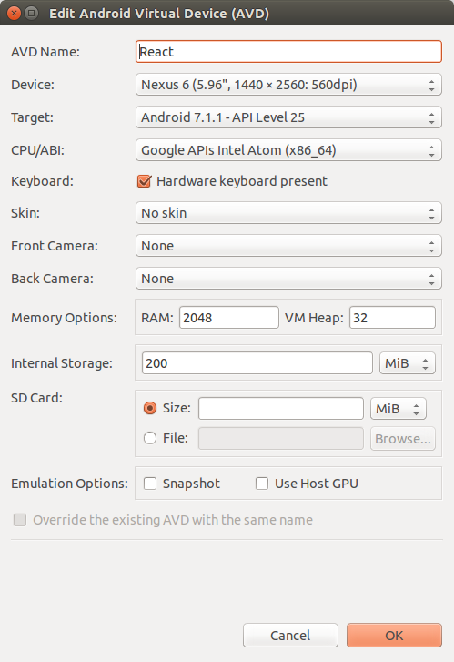

HackFridays: Mobile React 101 package starter
==================================
A simple starter kit for HackFridays: Mobile React 101 package.


## Installation

1.  Please make sure to carefully follow all the instructions on React Native's official documentation depending on your development operating system:
    * [Getting Started with React-Native](https://facebook.github.io/react-native/docs/getting-started.html#content)

2.  Clone the starter kit: `https://github.com/Cloudoki/react-native-boilerplate.git`

3.  Install project dependencies:
    `npm install`

## Testing your React Native Installation

After following the React Native's tutorial and installing all the project dependencies, you should be able to run and test your mobile application.

### Run React Native Packager

The [React Native Packager](https://github.com/facebook/react-native/tree/master/packager) is similar to Webpack, providing a CommonJS-like module system, JavaScript compilation (ES6, Flow, JSX), bundling, and asset loading.
```
react-native start
```

### Running the App

#### For Android:

1.  In Android Studio, open the project located in the `android` folder.
2.  Go to Tools -> Android -> AVD Manager
3.  Create a Virtual Device (See the example below)

    

4.  Run your Virtual Device
5.  Finally run the app with `react-native run-android`

#### For iOS:

The process for running your app in iOS is more straightforward. Just run `react-native run-ios` command and you should see your app running in the iOS Simulator shortly. You can also run it directly from within Xcode by opening the project located in `ios/Hackfridays.xcodeproj`.

**Note:** If you want to test your app on an actual device, follow the instructions [Running on Device](https://facebook.github.io/react-native/docs/running-on-device.html).


## Project File Structure
```
.
├── .babelrc                  # Configures Babel
├── .editorconfig             # Configures editor rules
├── .eslintrc                 # Configures ESLint
├── .flowconfig               # Configures Flow
├── .gitignore                # Tells git which files to ignore
├── .gitattributes            # Gives attributes to pathnames
├── index.android.js          # Entry point for your Android app into the React Native code
├── index.ios.js              # Entry point for your IOS app into the React Native code
├── package.json              # Package configuration. The list of 3rd party libraries and utilities
├── README.md                 # This file.
├── android                   # Directory with all your Android native code
├── ios                       # Directory with all your IOS native code
├── src                       # Source code
│   ├── components            # React components
│   ├── constants             # Application constants including constants for Redux
│   ├── containers            # High order component logic wrappers
│   ├── images                # App images
│   ├── reducers              # Redux reducers. Your state is altered here based on actions
│       ├── index.js          # Combines all reducers into one
│   ├── store                 # Redux store configuration
│   ├── Hackfridays.js             # Entry point for your app
```


##Technologies

| **Tech** | **Description** |**Learn More**|
|----------|-------|---|
|  [React](https://facebook.github.io/react/)  |   Fast, composable client-side components.    | [Pluralsight Course](https://www.pluralsight.com/courses/react-flux-building-applications)  |
|  [React Native](https://facebook.github.io/react-native/)  |   A framework for building native apps with React.    | [Egghead Course](https://egghead.io/courses/react-native-fundamentals)  |
|  [Redux](http://redux.js.org) |  Enforces unidirectional data flows and immutable, hot reloadable store. Supports time-travel debugging. Lean alternative to [Facebook's Flux](https://facebook.github.io/flux/docs/overview.html).| [Pluralsight Course](http://www.pluralsight.com/courses/react-redux-react-router-es6), [Egghead Course](https://egghead.io/courses/getting-started-with-redux)    |
|  [RN Router Flux](https://github.com/aksonov/react-native-router-flux) | React Native Router based on new React Native Navigation API | [Using react-native-router-flux](https://medium.com/differential/react-native-basics-using-react-native-router-flux-f11e5128aff9#.rgufob5ov) |
|  [Babel](http://babeljs.io) |  Compiles ES6 to ES5. Enjoy the new version of JavaScript today.     | [ES6 REPL](https://babeljs.io/repl/), [ES6 vs ES5](http://es6-features.org), [ES6 Katas](http://es6katas.org), [Pluralsight course](https://www.pluralsight.com/courses/javascript-fundamentals-es6)    |
| [ESLint](http://eslint.org/)| Lint JS. Reports syntax and style issues. Using [eslint-plugin-react](https://github.com/yannickcr/eslint-plugin-react) for additional React specific linting rules. | |

##Suggestions

* [Native Base](http://nativebase.io/): Essential cross-platform UI components for React Native.
